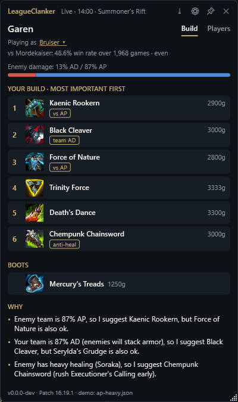
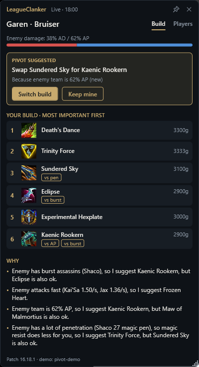
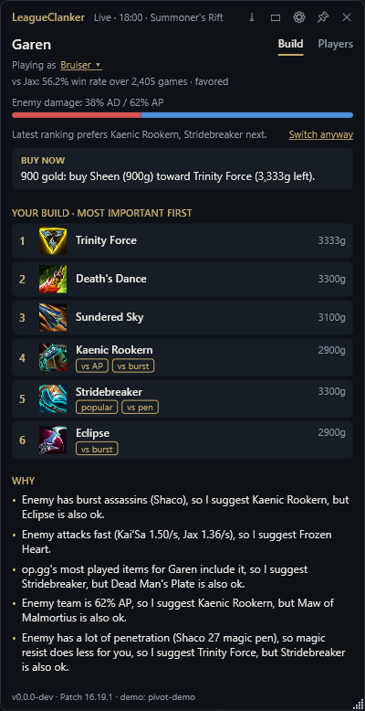
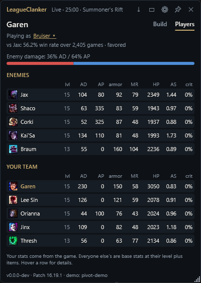
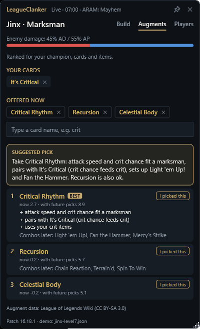

# LeagueClanker

A local Windows app that watches your League of Legends game and ranks what to buy next. It works out every player's stats from their champion, level and items, and recomputes whenever anyone's items, level or K/D change, every 2 seconds at most.

The window shows the build you accepted. When the game shifts enough that a different build would clearly be better, it suggests a pivot, and you choose. Decline, and it won't nag about those items again, but "Switch anyway" stays one click away.

It explains itself in plain sentences:

> Enemy team is 87% AP, so I suggest Kaenic Rookern, but Force of Nature is also ok.
>
> Enemy has 3 tanks (Ornn, Braum, Sejuani) at ~131 armor / 1930 HP, so I suggest Lord Dominik's Regards, but Mortal Reminder is also ok.

| Your build | Pivot suggested | After "Keep mine" | Everyone's stats |
|---|---|---|---|
|  |  |  |  |

In ARAM: Mayhem an Augments tab ranks the cards you're offered:



The screenshots come from the demo snapshots in `samples/`, not a live game.

## Running it

You need Windows and the .NET 10 SDK. The first launch downloads item and champion data from Riot's Data Dragon CDN and caches it per patch in `%LOCALAPPDATA%\LeagueClanker`.

```bash
dotnet run --project src/LeagueClanker.App
```

Then start a game. Practice Tool works. Run League in borderless or windowed mode, because exclusive fullscreen hides every other window.

To try it without a game, point it at a saved snapshot:

```bash
dotnet run --project src/LeagueClanker.App -- --demo samples/ap-heavy.json
```

`samples/mayhem/jinx-level7.json` is an ARAM: Mayhem game, so the Augments tab shows up. Add `--scan-image` to have it read the offer from a screenshot instead of the game, e.g. the mock one in the samples:

```bash
dotnet run --project src/LeagueClanker.App -- --demo samples/mayhem/jinx-level7.json --scan-image samples/mayhem/offer-mock.png
```

Point it at a folder to replay snapshots in order, one every 10 seconds. `samples/pivot-demo` is a Garen game where the enemy team switches from AD to AP items, which triggers a pivot suggestion:

```bash
dotnet run --project src/LeagueClanker.App -- --demo samples/pivot-demo
```

The CLI prints the same output as text, which is faster when tuning rules:

```bash
dotnet run --project src/LeagueClanker.Cli -- samples/three-tanks.json
```

Run it with no arguments to watch the live game, or with `--items` to list every item and the traits the parser detected. Give it a folder to replay snapshots through the pivot planner. It accepts every pivot, or declines them with `--decline`:

```bash
dotnet run --project src/LeagueClanker.Cli -- samples/pivot-demo --decline
```

For ARAM: Mayhem augments, give it a snapshot, the offered cards, and the cards you already picked, separated by `;`:

```bash
dotnet run --project src/LeagueClanker.Cli -- --mayhem samples/mayhem/jinx-level7.json --picked "It's Critical" --offer "Critical Rhythm;Recursion;Celestial Body"
```

`--augments` lists all 225 augments with the tags the parser gave them. `--scan` reads an offer from a screenshot, or from the running game with `--scan screen`. Add `--verbose` to see every line of text it recognized:

```bash
dotnet run --project src/LeagueClanker.Cli -- --scan samples/mayhem/offer-mock.png --verbose
```

To turn one of your own games into a sample, save the API response while in a match:

```bash
curl -k https://127.0.0.1:2999/liveclientdata/allgamedata -o samples/my-game.json
```

## Is it allowed

The app reads two things: Riot's official Live Client Data API on localhost, and Data Dragon. It doesn't read game memory, inject into the client, send input, or draw inside the game. It's an ordinary window next to the game, so Vanguard has nothing to object to.

Riot's third-party policy allows apps that highlight decisions with multiple choices rather than dictate them. That's why every suggestion comes with an alternative and a reason.

## How it works

Everything that matters lives in `src/LeagueClanker.Core`.

`LiveClient/` polls `allgamedata` every 2 seconds. `BuildAdvisor` recomputes when anyone's items, level or kills/deaths change.

`StaticData/` parses Data Dragon. Item stats come from the description's `<stats>` block, because the structured `stats` field leaves out lethality, penetration and ability haste. Item effects like anti-heal ("Wounds"), stasis, spell shields and armor shred are regex matches on the description text. New items on a new patch get picked up without code changes, as long as Riot keeps the wording.

`Analysis/` turns each player into a profile. It estimates their archetype (mage, marksman, bruiser and so on), their AP/AD split, their threat from item gold and K/D, and how tanky, healing, shielding or CC-heavy they are. The AP/AD split starts from the champion and moves with what they buy, so an AP Kai'Sa counts as AP once she has the items.

Every player gets a full stat block in `StatBlock.cs`: AD, AP, attack speed, crit, lethality, % penetration, ability haste, life steal, omnivamp, armor, MR, health, move speed and range. Riot's API only exposes real stats for you, so yours come straight from the game, runes and buffs included. Percentage stats are the exception, because their units vary between game versions, so those still come from items. Everyone else's stats are base stats at their level, using League's growth curve, plus item stats. The Players tab shows all ten. Tankiness works the same way. Early on a tank champion is assumed to go tank. After about two items' worth of gold only what they bought counts, so an Ornn who built Liandry's and Sorcerer's Shoes stops counting as a tank. `samples/tanks-no-defense.json` shows that case. `ChampionKnowledge.cs` holds the hand-kept lists Data Dragon doesn't have: healers, shielders, true damage and heavy crowd control.

`Recommendation/` scores every legendary item for you. The base score is what your archetype values in its stats, minus anything past a cap you've already hit: crit stops at 100% and attack speed at 2.5 per second. Each rule that fires adds a bonus to items that answer it. Ranking is greedy with diminishing returns. Once one MR item answers "enemy is AP", the next MR item gets half the bonus, and items you already own count the same way. Without this, one strong situation fills all six slots with the same kind of item.

`BuildPlanner.cs` holds the build you accepted and compares every new ranking against it. It only suggests a pivot when all of these hold:

- An item enters your next 3 purchases.
- That item has a real in-game reason worth at least 0.5 points, so score noise from kills or levels doesn't count.
- You haven't declined that item this game.
- The swap scores at least 0.5 points better than what it replaces.

Accepting swaps just those items. Declining remembers them for the rest of the game. "Switch anyway" adopts the latest ranking whenever you want. Buying items from your build never counts as a pivot, and a new game or champion starts a fresh build.

### Game modes

The advisor reads `gameMode` and the map number from the live game. Summoner's Rift uses map 11 items. ARAM and ARAM: Mayhem (`KIWI`) use Howling Abyss items. Arena isn't supported.

### ARAM: Mayhem augments

The app reads the offer off your screen. Once you reach a pick level (3, 7, 11 or 15) without having taken that many cards, it screenshots the League window every 2 seconds and runs Windows' built-in text recognition on it. That takes about 130 ms. It only looks at the middle of the screen, which skips chat and the HUD, and it blacks out its own window so it never reads its own suggestions. `AugmentTextMatcher` matches the text against the card names by edit distance. That way OCR slips like "CRITICA1" and names that wrap over two lines still count, and a stray card name of another tier elsewhere on screen is ignored. When cards show up, the app switches to the Augments tab with a chime. A reroll changes the offer, and the ranking follows.

It can't see which card you click, only that the cards disappeared, so it asks. Press *I picked this* on the card you took and it joins your cards for the next offer.

You can always type cards instead: type part of a name and mark each match as *Offered* (on screen now) or *Picked* (you already have it). Enter adds the top match to the offer. That covers misread names, cards you picked before starting the app, and exclusive fullscreen, where screenshots come back black.

`Augments/` ranks the three cards in an augment offer by the best final set of four they lead to, without win rates:

1. `AugmentDataClient` downloads the wiki's augment data (225 cards) and caches it for a day. Riot's own data has no Mayhem augments.
2. `AugmentTagger` tags each card with what it gives (attack speed, true damage, shields, ...) and what it needs or scales with (attacking, crits, pets, AP ratio, ...), from the description text. A short override list fixes cards the patterns misread.
3. `AugmentScorer` values a card by its fit with your champion, its pairings with the cards you picked (a card that pays off on attacks wants attack speed), your items (on-hit items, "Upgrade Infinity Edge"), and the game situation from the item rules.
4. `AugmentAdvisor` simulates your remaining picks 1,500 times per option with Mayhem's rules: picks at levels 3, 7, 11 and 15, one tier per offer, the first two offers never both Silver, one reroll per card. It ranks each option by the average value of the final set. That's how a weaker card that sets up combos can beat a stronger card that leads nowhere.

Card tier odds aren't published, so the simulation treats Silver, Gold and Prismatic as equally likely.

### Rules

All in `Recommendation/BuildRules.cs`.

| Rule | Fires when | Pushes |
|---|---|---|
| DamageTypeRule | enemy damage is 60%+ AP or AD | the matching resistance |
| MixedDamageRule | enemy split is 40-60% and you're a frontliner | dual resist and health |
| TankShredRule | 2+ enemies actually built tanky, or high average armor/MR | % penetration and shred if they stacked resists, %HP damage if they stacked health. Lethality loses points |
| SquishyTeamRule | 3+ squishies and you build flat pen | lethality or flat magic pen |
| AntiHealRule | enemy healing, weaker if an ally already has anti-heal | Wounds items, plus the component to rush |
| AntiShieldRule | lots of enemy shields | Serpent's Fang |
| CritDefenseRule | enemy carries at 40%+ crit chance | Randuin's Omen |
| AttackSpeedDefenseRule | enemies attacking 1.1+ times per second | Frozen Heart |
| EnemyPenetrationRule | enemies with 20+ lethality, 30%+ armor pen, 15+ magic pen or 35%+ magic pen | health over the resist they cut through |
| CrowdControlRule | heavy enemy CC | tenacity and cleanse |
| BurstDefenseRule | a fed assassin or several | stasis and spell shields |
| TrueDamageRule | 2+ true damage champions | health |
| NoFrontlineRule | you're a frontliner and no ally is | health and resists |
| TeamDamageSkewRule | your team is 75%+ one damage type | % penetration |

To add a rule, implement `IBuildRule`, return a `Situation` with a label, a sentence, an impact and a match function, and add it to `BuildRules.Default`. Thresholds and weights are constants at the top of each rule. Archetype stat weights and core items are in `ArchetypeProfiles.cs`. Change one, rerun the CLI on the samples, and see what moved.

## Known gaps

- Enemy stats are estimates. Runes, stat shards and stacking passives (Malphite, Cho'Gath, Sion) don't show up in the API.
- Only stats and keyword traits count. Rabadon's Deathcap's AP multiplier, for example, is invisible to the scorer. The core-item bonus papers over some of this.
- Your own archetype comes from Riot's class tags plus a short override list. Off-meta picks like AP Shaco get the wrong item pool. A manual archetype picker in the window would fix it.
- Arena isn't supported. Riot's policy also rules out showing win rates for augments and Arena items, so the augment advisor reasons from card effects only.
- Augment tags come from description text. Expect some cards to be tagged wrong until they've been reviewed with `--augments`.
- Card names are matched in English, so screen reading needs the League client in English.
- Screen reading has only been tested on a mock screenshot, not on real games yet.
- Picked augments don't change the item advice yet, e.g. a crit augment should push crit items up.
- The core-item lists and weights are my best guess for patch 16.18. Real win-rate data per matchup would beat them.

## Legal

Augment data comes from the [League of Legends Wiki](https://wiki.leagueoflegends.com/en-us/Module:MayhemAugmentData/data) under CC BY-SA 3.0.


LeagueClanker isn't endorsed by Riot Games and doesn't reflect the views or opinions of Riot Games or anyone officially involved in producing or managing Riot Games properties. Riot Games, and all associated properties are trademarks or registered trademarks of Riot Games, Inc.
