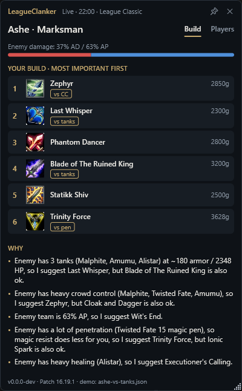
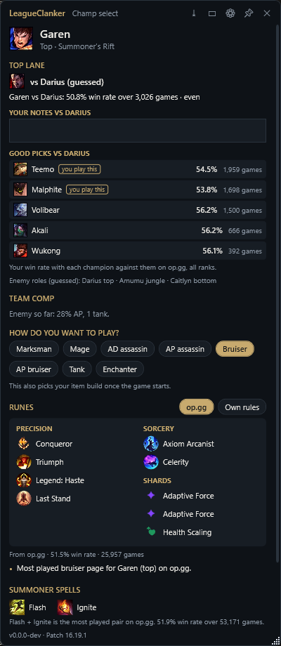
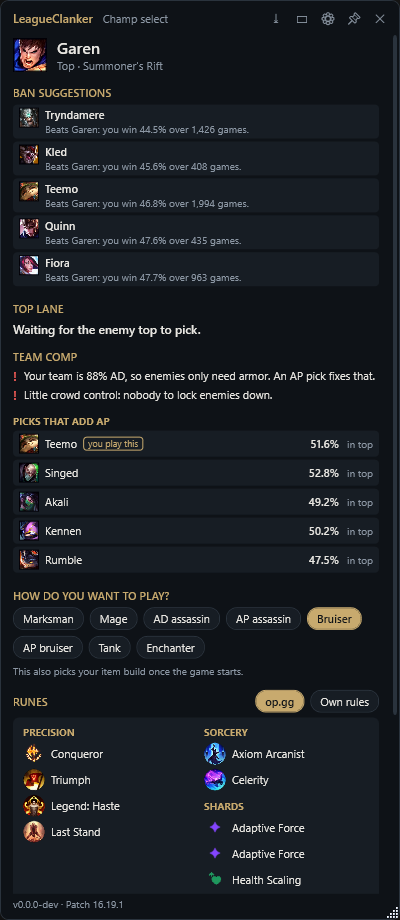
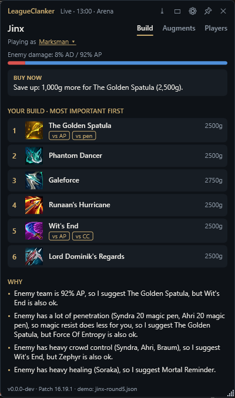
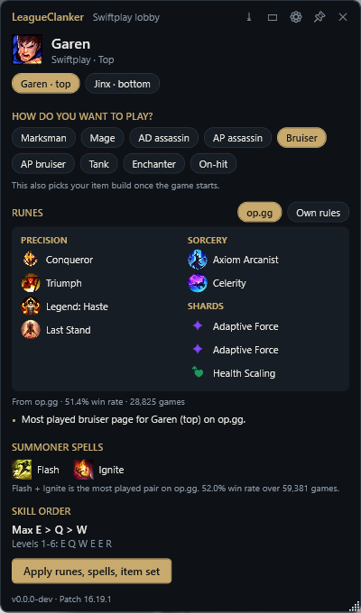
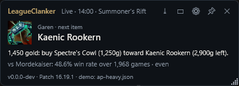
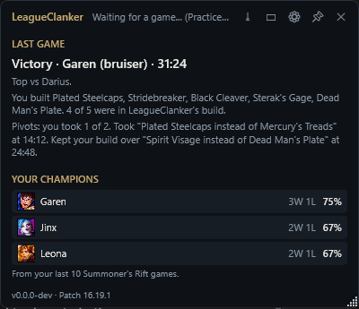
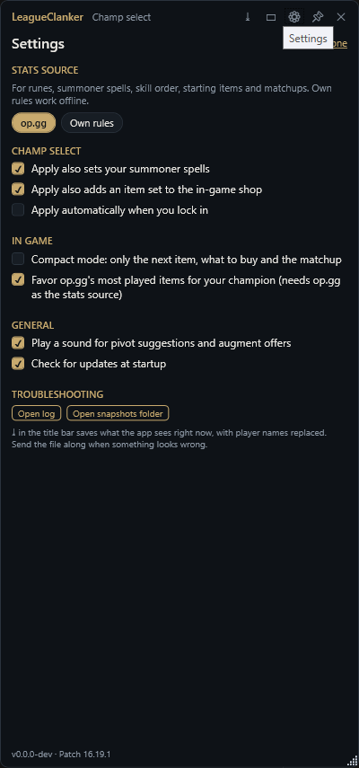

# LeagueClanker

A local Windows app that watches your League of Legends game and tells you what to buy next. It takes the builds players actually use for your champion on op.gg and picks the one that fits this game: on-hit Katarina against three tanks, AP burst against squishies. It works out every player's stats from their champion, level and items, and recomputes whenever anyone's items, level or K/D change, every 2 seconds at most.

The window shows the build you accepted, and what your gold buys toward the next item right now. When the game shifts enough that a different build would clearly be better, it suggests a pivot, and you choose. Decline, and it won't nag about those items again, but "Switch anyway" stays one click away.

It explains itself in plain sentences:

> Enemy team is 87% AP, so I suggest Kaenic Rookern, but Force of Nature is also ok.
>
> Enemy has 3 tanks (Ornn, Braum, Sejuani) at ~131 armor / 1930 HP, so I suggest Lord Dominik's Regards, but Mortal Reminder is also ok.

| Your build | Pivot suggested | After "Keep mine" | Everyone's stats |
|---|---|---|---|
|  |  |  |  |

In ARAM: Mayhem and Arena an Augments tab ranks the cards you're offered:


In League Classic it recommends from the old item shop, with the old stats:



In champ select it suggests bans, checks your team's comp, and shows your lane opponent with champions that beat them before you lock in. You pick how you'll play, and one click writes the matching rune page, summoner spells and a shop item set into the client:

| Picking | Banning |
|---|---|
|  |  |

Arena gets its own item shop, and Swiftplay's two lobby champions get runes and spells before you queue:

| Arena | Swiftplay |
|---|---|
|  |  |

For playing on one screen there's a compact mode, with just the next item, what to buy and the matchup:



Between games it recaps the last one, with how much of LeagueClanker's build you followed, and shows your record per champion. In champ select your record against the enemy laner shows up next to the matchup:



The screenshots come from the demo snapshots in `samples/`, not a live game.

## Download

Get `LeagueClanker.exe` from the [latest release](https://github.com/Thovenaar/LeagueClanker/releases/latest). It runs on Windows 10 and 11 without installing anything. The exe isn't code-signed, so Windows SmartScreen may warn the first time: click *More info*, then *Run anyway*.

## Running it from source

You need Windows and the .NET 10 SDK. The first launch downloads item and champion data from Riot's Data Dragon CDN and caches it per patch in `%LOCALAPPDATA%\LeagueClanker`.

```bash
dotnet run --project src/LeagueClanker.App
```

Then start a game. Practice Tool works. Run League in borderless or windowed mode, because exclusive fullscreen hides every other window.

To try it without a game, point it at a saved snapshot:

```bash
dotnet run --project src/LeagueClanker.App -- --demo samples/ap-heavy.json
```

`samples/mayhem/jinx-level7.json` is an ARAM: Mayhem game, so the Augments tab shows up. Add `--scan-image` to have it read the offer from a screenshot instead of the game, e.g. the mock one in the samples:

```bash
dotnet run --project src/LeagueClanker.App -- --demo samples/mayhem/jinx-level7.json --scan-image samples/mayhem/offer-mock.png
```

`samples/classic/ashe-vs-tanks.json` is a League Classic game: Ashe against three tanks, with the classic items.

`--champselect` shows a saved champ select instead of the live one. *Apply* then only says what it would write:

```bash
dotnet run --project src/LeagueClanker.App -- --champselect samples/champselect/leona-support.json
```

`samples/champselect/top-vs-darius.json` is a top laner who hasn't locked in yet, against a Darius, so it shows counter picks. `samples/champselect/ban-phase.json` is the same player during bans, with an all-AD team. `samples/champselect/swiftplay.json` is a Swiftplay lobby with two champions.

`samples/arena/jinx-round5.json` is an Arena game and `samples/mayhem/ashe-classic.json` an ARAM: Mayhem Classic game. `samples/mayhem/katarina-vs-tanks.json` is Katarina against three tanks and a healer, where op.gg's on-hit build wins over the AP one.

`--games` shows a copy of a saved game history instead of your own, so the recap and your champions appear without playing. It combines with `--champselect`:

```bash
dotnet run --project src/LeagueClanker.App -- --games samples/history/games.json
```

Point it at a folder to replay snapshots in order, one every 10 seconds. `samples/pivot-demo` is a Garen game where the enemy team switches from AD to AP items, which triggers a pivot suggestion:

```bash
dotnet run --project src/LeagueClanker.App -- --demo samples/pivot-demo
```

The CLI prints the same output as text, which is faster when tuning rules. It follows op.gg's builds like the app, unless you add `--no-meta`:

```bash
dotnet run --project src/LeagueClanker.Cli -- samples/three-tanks.json
```

Run it with no arguments to watch the live game, or with `--items` to list every item and the traits the parser detected. `--items 12` lists the Howling Abyss items, `--items 30` the Arena ones and `--items 453` the League Classic ones. Give it a folder to replay snapshots through the pivot planner. It accepts every pivot, or declines them with `--decline`:

```bash
dotnet run --project src/LeagueClanker.Cli -- samples/pivot-demo --decline
```

For ARAM: Mayhem augments, give it a snapshot, the offered cards, and the cards you already picked, separated by `;`:

```bash
dotnet run --project src/LeagueClanker.Cli -- --mayhem samples/mayhem/jinx-level7.json --picked "It's Critical" --offer "Critical Rhythm;Recursion;Celestial Body"
```

Add `--rerolled "Recursion"` for cards whose reroll is used up, and `--golden "Celestial Body"` for the card with the golden reroll. It uses arammayhem.com's win rates unless you add `--no-community`.

For rune pages, name a champion. Add a role, a playstyle, the mode or enemies to see how the page changes, and `--source rules` to skip op.gg. It also prints the summoner spells, skill order and shop item set that *Apply* would write:

```bash
dotnet run --project src/LeagueClanker.Cli -- --runes Ezreal --position bottom --style mage
```

During champ select, `--champselect` does the same for your pick and adds your lane matchup. `--champselect --apply` writes the page into the client.

`--matchup` guesses the enemy roles and shows your lane matchup. Use `-` instead of a champion, or add `--hover`, to see counter picks. `--allies` adds the team comp check and `--ban` adds ban suggestions:

```bash
dotnet run --project src/LeagueClanker.Cli -- --matchup - --position top --enemies "Darius;Amumu;Caitlyn"
```

`--augments` lists the Mayhem augments with the tags the parser gave them, and `--augments arena` the Arena ones. Add `--locale de_DE` to see each card's name in that language. `--scan` reads an offer from a screenshot, or from the running game with `--scan screen`. Add `--verbose` to see every line of text it recognized, and `--locale` to read a client in another language:

```bash
dotnet run --project src/LeagueClanker.Cli -- --scan samples/mayhem/offer-mock.png --verbose
```

`samples/mayhem/offer-1440p.png` is a real offer at 2560x1440, the kind plain text recognition couldn't read.

`--history` prints your record per champion and per lane opponent, from the League client's match history and the games the app saved. Give it a file to read other saved games instead:

```bash
dotnet run --project src/LeagueClanker.Cli -- --history samples/history/games.json
```

`--champions` lists the healers, shielders, crowd control and true damage champions, marking the ones the ability tooltips added to the hand-kept lists, and shows per champion which abilities heal, shield, crowd control or deal true damage. `--items` also shows the passives it could read, like Rabadon's Deathcap's 30% AP:

```bash
dotnet run --project src/LeagueClanker.Cli -- --champions
```

To turn one of your own games into a sample, save the API response while in a match:

```bash
curl -k https://127.0.0.1:2999/liveclientdata/allgamedata -o samples/my-game.json
```

## Releasing

The Release workflow tests the code, builds a single self-contained `LeagueClanker.exe` and publishes it as a GitHub release. Start it from the Actions tab (*Release*, then *Run workflow*) with a version number, or from the command line:

```bash
gh workflow run release.yml -f version=0.2.0
```

Tick *dry run* (or add `-f dry_run=true`) to build and test without publishing. The exe is then kept as a workflow artifact.

`tools/Capture-Screenshots.ps1` regenerates the README screenshots from the demo samples. `CLAUDE.md` and the skills in `.claude/skills` describe the conventions for tests, the README, screenshots, external data and releases.

## Is it allowed

During a game the app reads Riot's official Live Client Data API on localhost, and Data Dragon. It doesn't read game memory, inject into the client, send input, or draw inside the game. It's an ordinary window next to the game, so Vanguard has nothing to object to.

In champ select it reads the League client's local API, the same one Porofessor, Blitz and Mobalytics use to import runes. The only things it changes are what *Apply* writes: your rune page, your summoner spells and an item set for the shop. With *Apply automatically* turned on in the settings, that happens when you lock in. Riot doesn't document that API, but it has tolerated rune importers for years.

It also reads your own match history from that API, for your record per champion, and the client's language, to read augment cards in it. It only uses what the client shows you: picks as they lock in, your own role, mastery, champions and past games. It doesn't try to reveal what champ select hides, like player names in ranked or enemy picks in blind pick. That's what gets tools banned, while counters and matchup stats are what every approved app shows.

Riot's third-party policy allows apps that highlight decisions with multiple choices rather than dictate them. That's why every suggestion comes with an alternative and a reason.

One setting goes against that policy: Riot asks apps not to show augment win rates during a game, and LeagueClanker starts its Mayhem card scores from arammayhem.com's win rates. It's on by default because this is a local tool. Turn off *Start Mayhem augment scores from arammayhem.com's win rates* in the settings to score cards from their effects alone.

## How it works

Everything that matters lives in `src/LeagueClanker.Core`.

`LiveClient/` polls `allgamedata` every 2 seconds. `BuildAdvisor` recomputes when anyone's items, level or kills/deaths change.

`StaticData/` parses Data Dragon. Item stats come from the description's `<stats>` block, because the structured `stats` field leaves out lethality, penetration and ability haste. Item effects like anti-heal ("Wounds"), stasis, spell shields and armor shred are regex matches on the description text. New items on a new patch get picked up without code changes, as long as Riot keeps the wording.

`ItemScaling.cs` reads passives whose stats depend on yours: Rabadon's Deathcap's "Increases your total Ability Power by 30%", Riftmaker's and Overlord's Bloodmail's share of bonus health as AP or AD, Warmog's bonus health and Jak'Sho's bonus resists. It also reads stats that build up during the game, like Rod of Ages (10 times 10 health, 30 mana and 3 AP) and Yun Tal's 25% crit, and counts those fully stacked. The item advisor values these with your current stats, so Rabadon's climbs as your AP grows, and the build card says what they add ("Magical Opus: +95 AP"). Enemy stat estimates include the passives of items they own.

`Analysis/` turns each player into a profile. It estimates their archetype (mage, marksman, bruiser and so on), their AP/AD split, their threat from item gold and K/D, and how tanky, healing, shielding or CC-heavy they are. The AP/AD split starts from the champion and moves with what they buy, so an AP Kai'Sa counts as AP once she has the items.

Every player gets a full stat block in `StatBlock.cs`: AD, AP, attack speed, crit, lethality, % penetration, ability haste (cooldown reduction in League Classic), life steal, omnivamp, spell vamp, armor, MR, health, move speed and range. Riot's API only exposes real stats for you, so yours come straight from the game, runes and buffs included. Percentage stats are the exception, because their units vary between game versions, so those still come from items. Everyone else's stats are base stats at their level, using League's growth curve, plus item stats. The Players tab shows all ten. Tankiness works the same way. Early on a tank champion is assumed to go tank. After about two items' worth of gold only what they bought counts, so an Ornn who built Liandry's and Sorcerer's Shoes stops counting as a tank. `samples/tanks-no-defense.json` shows that case. `ChampionKnowledge.cs` holds hand-kept lists of healers, shielders, true damage and heavy crowd control. `ChampionAbilities.cs` adds to them from the ability tooltips in Data Dragon's championFull.json, which mark healing, shields, true damage and statuses like stuns. It adds a champion when at least 2 abilities heal, 2 shield, 3 have hard crowd control (stuns, knock-ups, roots, suppression, charms, fears, taunts, sleeps, pulls) or 1 deals true damage to champions. The bar is high because the hand-kept lists already cover most champions, but new champions get picked up without a code change.

`Recommendation/` scores every legendary item for you. The base score is what your archetype values in its stats, minus anything past a cap you've already hit: crit stops at 100% and attack speed at 2.5 per second. Each rule that fires adds a bonus to items that answer it. Ranking is greedy with diminishing returns. Once one MR item answers "enemy is AP", the next MR item gets half the bonus, and items you already own count the same way. Without this, one strong situation fills all six slots with the same kind of item.

`BuildPlanner.cs` holds the build you accepted and compares every new ranking against it. It only suggests a pivot when all of these hold:

- An item enters your next 3 purchases.
- That item has a real in-game reason worth at least 0.5 points, so score noise from kills or levels doesn't count.
- You haven't declined that item this game.
- The swap scores at least 0.5 points better than what it replaces.

Accepting swaps just those items. Declining remembers them for the rest of the game. "Switch anyway" adopts the latest ranking whenever you want. Buying items from your build never counts as a pivot, and a new game or champion starts a fresh build.

Your next three purchases keep the order of the latest ranking, so a new augment can move your third item to first without asking. Moving a later item into those three does need a pivot.

### Champ select: lane matchup

The client shows each enemy champion once it's locked in, but not their role. `RoleGuesser` guesses the roles: every enemy gets a different role, and the guess is the combination op.gg's play rates make most likely. Garen goes top, and Lux goes support when their Syndra is already mid. The guess updates with every pick. Offline, it guesses from champion classes instead.

The enemy in your role is your lane opponent. In bottom lane you also see the other half of their duo.

- **Before you lock in**, it lists up to five champions that beat your lane opponent: your win rate with each champion against them, from op.gg. It only lists champions you can pick, with at least 200 games and a win rate of 51% or more. Champions with 20,000+ mastery points come first and are marked *you play this*. The champion you're hovering is left out, since its matchup is shown already.
- **Once you have a champion**, it shows that matchup: "Garen vs Darius: 50.4% win rate over 2,792 games · even". 52% and up counts as favored, 48% and below as tough.
- **In game**, the matchup line sits under your champion's name. Matchmade games report every role, so nothing is guessed there.

op.gg's ranked data is read for all ranks. That's about four times the games of their default Emerald+ filter. With only a hundred games a pairing's win rate jumps around; Ornn looked like a 60% counter to Darius at Emerald+, and is 54% over all ranks. ARAM, Arena and League Classic have no lanes, so they get no matchup.

### Champ select: bans, team comp and notes

- **Bans.** While your ban is still to come, it lists up to five champions to ban. With a champion in mind (your hover), these are the champions it loses to most, at 49% or less over at least 200 games. Without one, they're the strongest champions in your role by op.gg's tier. Banned champions and your teammates' hovers are left out.
- **Team comp.** Once your team has picks (teammates count with their hover), it warns about gaps. It checks for no tank or bruiser in three or more picks, a team that's 80% or more one damage type, and no heavy crowd control in four or more picks. Before you lock in, it lists up to five champions in your role that fill the biggest gap, with a frontline first, then the other damage type, then crowd control. Champions you play come first. It also sums up the enemy picks so far: their AP share, tanks and crowd control.
- **Notes.** Under your lane opponent there's a box for your own notes, like "Darius: don't trade at level 2". It saves as you type, in `%LOCALAPPDATA%\LeagueClanker\notes.json`. The note shows up again the next time you face that champion, in champ select and under the matchup line in game.

`DraftAdvisor.cs` holds these thresholds. The damage split and crowd control come from champion classes, the hand-kept lists in `ChampionKnowledge.cs` and the ability tooltips, so they're estimates before anyone buys items.

### Champ select: playstyle and runes

Every champion can be played more than one way: AP Ezreal, AD Thresh, tank or AD Leona. In champ select the app shows nine playstyles: marksman, mage, AD assassin, AP assassin, bruiser, AP bruiser, tank, enchanter and on-hit. It picks the default from your champion and role:

- Your role is the position champ select assigns you. In blind pick and normals, where nothing is assigned, it's the role you queued for.
- The default is how the champion is normally played, which is also what the item advisor assumes. In support, a fighter who can tank, like Taric or Braum, defaults to tank.
- ARAM has no roles, so AD and AP champions default to their damage playstyle and tanks to tank.
- **On-hit** is for attack speed builds around items whose attacks deal extra damage: Blade of the Ruined King, Kraken Slayer, Nashor's Tooth, Guinsoo's Rageblade, Wit's End and Terminus. It values attack speed first and AD and AP both at half, and items with an on-hit effect get 0.8 extra. Your damage counts as magic or physical by your actual split, so on-hit Kayle is treated as magic and Vayne as physical. Kayle, Kog'Maw, Kalista, Vayne and Master Yi default to it; on-hit Katarina, Kai'Sa or Teemo is one click away.

Change it with one click. The choice carries into the game, where it decides your item build: an AP Ezreal gets AP items. You can change it in game too, with *Playing as* under your champion's name. The build switches right away, without a pivot suggestion, because it was your decision.

The rune page comes from the source you choose, and the app remembers the choice:

- **op.gg** (default): the most played page on op.gg for your champion, role or ARAM, and playstyle. Pages whose keystone doesn't fit your playstyle are skipped, so AP Ezreal doesn't get Lethal Tempo. Pages with fewer than 50 games are skipped too. The data comes from the unofficial JSON API behind op.gg's champion pages, all ranks, once per champion and role per session.
- **Own rules**: a standard page per playstyle in `RuleRuneSource.cs`, like Aftershock for engage tanks and Grasp for tanks in lane, adjusted to the enemy picks you can see. Two tanks swap Coup de Grace for Cut Down. Heavy crowd control gets the tenacity shard. Three ranged champions swap Bone Plating for Second Wind, and two assassins swap it back.

When op.gg has no page for your playstyle (AD Thresh), or doesn't answer, you get the rules' page with a line saying so. Runes are named, not numbered, so if Riot removes one, the first rune of that row takes its place.

*Apply* overwrites your current rune page. Preset pages can't be edited, so then it updates a page it wrote before ("LeagueClanker Jinx"), or makes a new one if you have a free page slot. If neither works, it asks you to select one of your own pages. It never overwrites a page you didn't select.

### Champ select: spells, skill order and item set

The same source decides the rest of what *Apply* writes. The settings choose which parts it writes.

- **Summoner spells.** op.gg's most played pair for your champion and role. A pair has to fit the role: no Smite outside the jungle, always Smite in it. Without op.gg it's Flash plus a role spell: Smite in the jungle, Teleport top, Ignite mid, Heal for bottom marksmen, Exhaust for enchanters. ARAM gets Mark. Flash stays on the key you keep it on, and League Classic gets its own copies of the spells.
- **Skill order.** Which ability to max first and the first six levels, from op.gg's most played order.
- **Item set.** A set named "LeagueClanker Jinx" in the shop's recommended tab. It has starting items (op.gg's most played start, or a Doran's item, jungle pet or World Atlas), the item advisor's core build for this game with your playstyle against the enemies you can see, boots, situational items, and op.gg's most played three-item core. Your own item sets are read first and written back untouched. Only a set LeagueClanker wrote for the same champion gets replaced.

### Builds: op.gg's builds, picked for each game

Scoring every item on its own gave builds that looked random: full AP Katarina into three tanks, when Blade of the Ruined King and Kraken Slayer were clearly better. So the build now starts from what players build. `MetaBuilds` takes op.gg's core builds (the first three items) for your champion in your role, or in ARAM:

1. **Styles.** Cores with at least 50 games are grouped by the playstyle their items belong to: on-hit, AP, crit, bruiser, tank and so on, at most four. Each style gets its most played core, plus up to three later items that players of that style finish with. Stormsurge is popular on Katarina, but it isn't an on-hit item, so the on-hit build doesn't get it.
2. **Choosing.** Each style scores its win rate (0.2 points per percentage point above or below 50%, trusted by sample size: games divided by games plus 200), how well its items answer this game's situations (the same rules as below: tanks, healing, damage split), 1 point for each item of it you already own, and 0.5 for the build chosen last time so close builds don't swap back and forth.
3. **Your playstyle follows.** The chosen build's style becomes your playstyle, in game and in champ select, so runes and augment advice match it. You don't need to pick on-hit by hand. A playstyle you pick yourself stays, and limits the choice to builds of that kind.
4. **One swap at most.** A later item (never the first three) is swapped when another item answers this game at least 1 point better, with a real reason, like anti-heal against healers. The window says so: "For this game: Chempunk Chainsword instead of Terminus: enemy has heavy healing".

The list keeps the build's order, which is the order players buy it in; only an item you've started moves up. The window shows which build it follows and why: "Build: op.gg's on-hit build (56.8% win rate over 444 games), over the AP burst build (43.7%)." When the chosen build changes mid-game, it's a pivot you accept, like any other. Pivots only bring in the build's own items or its swap: once most of it is bought, other items fill the list, and trading one filler for another isn't worth asking about. A pivot you accepted isn't suggested again, and the swap never removes an item you've started. Without op.gg's data (Arena, League Classic, a rare pick, op.gg down, or the setting off), items are scored one by one as before.

### In game: what to buy, tips and compact mode

- **Buy now.** The card above your build turns your current gold into a purchase toward your next item. The shop only charges for the parts you don't own yet, so it counts those. When the whole item is affordable it says so ("Buy Black Cleaver now: 1,100g with the parts you have"). Otherwise it picks the parts that spend the most of your gold, bigger parts first: "1,450 gold: buy Spectre's Cowl (1,250g) toward Kaenic Rookern (2,900g left)". When nothing fits, it says how much to save up. It follows your gold in steps of 50.
- **Starting items.** In the first two minutes of a Summoner's Rift game, before you buy anything, it shows what to start with: op.gg's most played start, or a Doran's item, a jungle pet or World Atlas.
- **Tips.** Once all six item slots hold finished items, it suggests swapping your weakest item when a new one scores at least a point higher for this game. From 25 minutes, with 500 gold spare, it suggests an elixir for your playstyle. Supports, junglers and full builds get a reminder to carry a Control Ward.
- **op.gg's builds.** With op.gg as the stats source, your build is one that players actually use. See *Builds* below.
- **Your items and slots.** A "You have" row shows your finished items and boots. The plan below it only lists what fits in your remaining slots, and when all six are full it points to the swap tips.
- **Other ways to go.** Under your plan, up to 3 alternatives each take the build a different way: an answer to the game ("Vs tanks: Void Staff") or a different kind of item ("Tankier: Zhonya's Hourglass", "More AP: Rabadon's Deathcap").
- **Finishing what you started.** When you own parts worth at least a quarter of an item in your plan (`BuildPlanner.StartedShare`), that item comes next, and a pivot won't drop it. An item also needs to outscore the one ahead of it by 0.5 (`ReorderMargin`) to move ahead, so two close items don't swap places every time your stats change.
- **Compact mode.** The ▭ button in the title bar shrinks the window to the next item, what to buy and the matchup. When augment cards are on screen, it shows which to take and which to reroll above that.

### Between games: recap and your stats

`History/` keeps track of the games you play. While a game runs, `GameRecorder` notes every item LeagueClanker put in your build and every pivot you took or turned down. When the game's API goes away, it writes a recap to `%LOCALAPPDATA%\LeagueClanker\games.json`, which keeps your last 200 games. Games under 5 minutes, like remakes and Practice Tool peeks, get no recap. The result comes from the game's end event. The game sometimes closes before that event reaches the app; then the app reads the result from the League client's end-of-game screen, matched by your champion and the game's length. Without either, the recap has no result and doesn't count toward your record.

The recap says who you laned against, your final legendary items and boots, how many of them were in LeagueClanker's build, and each pivot with its time. It shows whenever you're not in champ select or a game.

Your record per champion counts Summoner's Rift games only: normal, ranked, Swiftplay and League Classic. League Classic shows up in the match history as "JADE" on map 453, with champion ids from 60000 (60021 is Miss Fortune). It combines two sources. The recaps cover every game the app watched. When the League client is running, the app also reads your last 30 games from its match history (20 per request), with the full scoreboard of the 15 newest to find your lane opponent. A game in both counts once (the same champion, starting within 10 minutes). The window lists your 6 most played champions.

In champ select, counter picks you've played at least 3 times (`PersonalStats.MinGames`) show your record instead of the game count. The matchup line adds your record against the enemy laner once you've met them.

### Settings, logs and snapshots

The gear in the title bar opens the settings: the stats source, what *Apply* writes, *Apply automatically*, compact mode, following op.gg's builds, arammayhem.com's augment win rates, sounds, and the update check. Settings are saved in `%LOCALAPPDATA%\LeagueClanker\settings.json`.



Errors the app recovers from, like op.gg not answering, go to `%LOCALAPPDATA%\LeagueClanker\log.txt`. The settings have a button to open it.

The ⤓ button saves what the app sees right now, the live game or champ select, to `Documents\LeagueClanker\snapshots`. Player names are replaced with "Player1", "Player2" and so on, so you can send it with a bug report. A saved game replays with `--demo`, and a saved champ select with `--champselect`.

At startup the app asks GitHub for the latest release. When there's a newer version, a link to it appears in the bottom right corner.

### Game modes

The advisor reads `gameMode` and the map number from the live game.

- **Summoner's Rift** (`CLASSIC`, and `SWIFTPLAY`) uses map 11 items.
- **ARAM** and **ARAM: Mayhem** (`KIWI`) use the Howling Abyss items.
- **ARAM: Mayhem Classic** (`KIWI_JADE`) uses League Classic's items on Howling Abyss, with Mayhem's augments. A Mayhem game where someone holds a classic item counts too.
- **League Classic** uses its own shop, see below.
- **Arena** (`CHERRY`) uses Arena's shop. That's mostly Arena's own copies of the items (22xxxx ids, bought outright, boots included) and its prismatic items (44xxxx), plus a few standard items. Arena's augments get the Augments tab. The Live Client API doesn't say who your duo partner is, so the whole lobby counts as enemies, and the rules about your team stay quiet.
- **Swiftplay** picks two champions in the lobby, before the queue, so there's no champ select. The app reads those lobby slots instead and shows the champ select panel for each champion, with a chip to switch between them. *Apply* writes the runes and spells into that champion's lobby slot, and adds the item set. There are no enemy picks to show yet, so there's no lane matchup.

### League Classic

League Classic is Summoner's Rift with the item shop, stats and champions of around 2014. Riot's data sells its items on map 453, as copies of the old items with ids from 770000 to 779999. The advisor treats a game as League Classic when:

- the map is 453, or the mode is `JADE` (the codename in the item texts), or
- the game reports itself as Summoner's Rift, but someone holds a classic item. Everyone starts with one, like Doran's Blade, so this kicks in within the first minute.

A real League Classic game reports mode `JADE` on map 453, and its champions as `Jade_MissFortune`, which the app reads as Miss Fortune whatever the client's language. Champ select and the match history number the champions from 60000 (60021 is Miss Fortune). The second check stays for snapshots like `samples/classic/ashe-vs-tanks.json`, which report themselves as Summoner's Rift.

What changes in League Classic:

- **Builds from Blitz.** op.gg has no League Classic data, so the builds come from Blitz.gg's League Classic pages (`BlitzClassicBuilds`): curated builds per champion, like an AD and a crit build for Miss Fortune, with the classic items. They have no win rates, so the game's situations and the items you own choose between them, the same way as op.gg's builds on today's Summoner's Rift. The build follows Blitz's order: its core, then the first new option for slots 4, 5 and 6. The one swap picks from Blitz's situational items for that build, and its boots come first unless the game has a real reason for others.
- **No runes.** League Classic uses its old masteries and runes, and the client's local API has no way to change them. Champ select says so instead of showing a rune page, and *Apply* only writes the summoner spells and the item set.

- **The shop.** Only classic items are recommended. Old items are cheaper, so any item that builds into nothing and costs 1,100 gold or more counts as finished. Doran's items don't. Boots build from the classic Boots of Speed.
- **Stats in passives.** Classic items keep some stats in their unique passives, like The Black Cleaver's "Wicked Edge: 10 Lethality", Ionian Boots' "15% Cooldown Reduction", the boots' move speed, and Last Whisper's "ignore 35% of your opponent's Armor". The parser reads those, but skips conditional ones like Mejai's "At 20 stacks, grants 15% Cooldown Reduction". Flat regeneration ("10 Mana Regen per 5 seconds") counts as 100% base regeneration.
- **Old stats.** Cooldown reduction takes the place of ability haste and stops counting at 40%. Spell vamp counts as sustain, and AP champions value it.
- **Stat growth.** Champions gain the same amount every level, instead of today's curve that saves more for later levels, and everyone gets 4 extra armor. That changes everyone's numbers on the Players tab and every rule built on them.
- **Staples.** Each archetype has its own classic core items: Last Whisper and Phantom Dancer for marksmen, Deathfire Grasp for AP assassins, Sunfire Cape and Randuin's Omen for tanks, Shurelya's Reverie for enchanters.
- **Jungle items.** Spirit of the Ancient Golem and the other jungle items only show up when you have Smite.
- **Old item wording.** Zhonya's "Invulnerable and Untargetable" counts as stasis and Quicksilver's "Removes all debuffs" as a cleanse. Randuin's attack speed slow, Madred's %max health damage and Abyssal Scepter's magic resist aura are recognized too.

### ARAM: Mayhem and Arena augments

The app reads the offer off your screen. In Mayhem, once you reach a pick level (3, 7, 11 or 15) without having taken that many cards, it screenshots the League window every 2 seconds and runs Windows' built-in text recognition on it. The cards have light text on dark, glowing art, which plain recognition often can't read, so it first reads a black and white version of the screen where only bright pixels stay (`ScreenImage.HighContrast`), and the plain image when that finds fewer than three cards. That takes about 130 ms, twice that when both run. It only looks at the middle of the screen, which skips chat and the HUD, and it blacks out its own window so it never reads its own suggestions. `AugmentTextMatcher` matches the text against the card names by edit distance. That way OCR slips like "CRITICA1" and names that wrap over two lines still count, and a stray card name of another tier elsewhere on screen is ignored.

The League client can run in another language. When it does, the app asks the client for its language and downloads the card names in it from Community Dragon (`AugmentTranslations`), joined to the English names on each card's id. That covers 223 of 225 Mayhem cards and 253 of 257 Arena cards. Text recognition then runs in that language, which Windows can only do when the language is installed (Settings, Time & language, Language & region). Without it, the Augments tab says so and reads in English, which still catches names that stay the same. You can also type a card's name in your language. When cards show up, the app switches to the Augments tab with a chime. A reroll changes the offer, and the ranking follows.

Arena offers augments between rounds, and the game doesn't report rounds. So in Arena the app keeps watching the screen until you have four cards. Arena's card list comes from the wiki's Arena module. Its simulation has no rule against two Silver offers in a row, because that rule is Mayhem's.

It can't see which card you click, only that the cards disappeared, so it asks. Press *I picked this* on the card you took and it joins your cards for the next offer. When one or two cards change while the rest stay, those were rerolls: they're marked as used up and the advice updates.

*Read cards now* next to the search box reads the screen right away, even when no pick is due, and says so when it finds no cards. You can always type cards instead: type part of a name and mark each match as *Offered* (on screen now) or *Picked* (you already have it). Enter adds the top match to the offer. After rerolling a card in game, press *Rerolled* on it and type the card you got. That covers misread names, cards you picked before starting the app, and exclusive fullscreen, where screenshots come back black.

`Augments/` ranks the three cards in an augment offer by the best final set of four they lead to:

1. `AugmentDataClient` downloads the wiki's augment data (225 Mayhem cards, 257 Arena cards) and caches it for a day. Riot's own data has neither.
2. `AugmentTagger` tags each card with what it gives (attack speed, true damage, shields, ...) and what it needs or scales with (attacking, crits, pets, AP ratio, ...), from the description text. A hand-kept list fixes cards the patterns misread and tags cards the wiki describes by what they do rather than by stats. Only random and economy cards (transmutes, Pandora's Box, rerolls, gold) stay untagged: 17 in Arena and 6 in Mayhem.
3. In Mayhem, `CommunityAugments` gives each card a starting score from arammayhem.com: 0.2 points per percentage point of win rate above or below 50%, at most 1.5 either way, so a 54% card gets +0.8 and a 44% card -1.1. A card that's among the ones players of your champion take most gets another 0.4. The pages are cached for a day. Without them, or with the setting off, cards score from their effects alone.
4. `AugmentScorer` values a card by its fit with your champion, its pairings with the cards you picked (a card that pays off on attacks wants attack speed), your items (on-hit items, "Upgrade Infinity Edge"), and the game situation from the item rules.
5. `AugmentAdvisor` simulates your remaining picks 1,500 times per option with Mayhem's rules: picks at levels 3, 7, 11 and 15, one tier per offer, the first two offers never both Silver, one reroll per card. It ranks each option by the average value of the final set. That's how a weaker card that sets up combos can beat a stronger card that leads nowhere. When two options' averages are within 0.2 (`AugmentAdvisor.CloseCall`), which is simulation noise, the card that's stronger right now goes first.

Cards built around something only some champions have (spinning abilities, pets, stealth, stacks) score by that alone: Spin To Win fits Garen fully, whatever else it mentions. Cards that replace Flash or Mark with another summoner spell count that as a cost.

Card tier odds aren't published, so the simulation treats Silver, Gold and Prismatic as equally likely.

It also says which cards to reroll. Each card in an offer has its own reroll, and unused rerolls are gone once you pick. So rerolling a card you won't take can only help: the new card either beats your best one or you ignore it. The real questions are which card to keep, and whether even that one is weak enough to reroll. To answer them, the advisor scores every card a reroll could give you, and marks each offered card:

- **KEEP**: your best card.
- **REROLL**: you won't take it, so reroll it.
- **REROLL LAST**: your best card, but a reroll usually beats it. Reroll the others first, and this one only if it's still your best.
- **GOLDEN REROLL** and **GOLDEN REROLL LAST**: the same, for the card whose reroll is golden.
- **REROLLED**: its reroll is used up.

A golden reroll comes from the Mayhem progression track. In Silver and Gold offers it sometimes appears on one card, and it rerolls that card into the next tier. The advice then compares that card with the higher tier: on a card you won't take it's always worth using, and on your best card it's worth it when the higher tier usually beats it. The app can't see which card has the golden button, so mark it with *Golden*. On screen, a card that changed into a higher tier counts as the golden reroll being used.

After you pick "Stats on Stats on Stats!", the next offer has two rerolls per card, and the advice says so.

Each card also shows how often a reroll beats it. For example: "Keep Critical Rhythm. Reroll Recursion and Celestial Body: you won't take them, so a reroll can only help." Or: "Reroll Minionmancer and Celestial Body first. If All For You is still your best card after that, reroll it too: a reroll beats it 75% of the time."

Picked augments also shape the item advice. `AugmentRules` turns each picked card into a situation, just like the enemy-based rules, so it ranks items, labels them and explains itself:

> Your Critical Rhythm augment pays off on crits, so I suggest Infinity Edge, but Phantom Dancer is also ok.

- A card that pays off on something (attacks, crits, abilities, health, shields) boosts the items that feed it.
- "Upgrade X" cards push X, and quest cards push the items the quest asks for.
- Crit chance and attack speed from cards count toward the caps, so crit chance on items is worth less once cards bring you close to 100%.
- A card that already answers a threat lowers that threat's weight, the same as owning an item for it. A magic resist card against an AP team makes more magic resist items less urgent.

To try it from the CLI, add the cards you picked to a snapshot:

```bash
dotnet run --project src/LeagueClanker.Cli -- samples/mayhem/jinx-level7.json --picked "It's Critical;Critical Rhythm"
```

### Rules

All in `Recommendation/BuildRules.cs`.

| Rule | Fires when | Pushes |
|---|---|---|
| DamageTypeRule | enemy damage is 60%+ AP or AD | the matching resistance |
| MixedDamageRule | enemy split is 40-60% and you're a frontliner | dual resist and health |
| TankShredRule | 2+ enemies actually built tanky, or high average armor/MR | % penetration and shred if they stacked resists, %HP damage if they stacked health. Lethality loses points |
| SquishyTeamRule | 3+ squishies and you build flat pen | lethality or flat magic pen |
| AntiHealRule | enemy healing, weaker if an ally already has anti-heal | Wounds items, plus the component to rush |
| AntiShieldRule | lots of enemy shields | Serpent's Fang |
| CritDefenseRule | enemy carries at 40%+ crit chance | Randuin's Omen |
| AttackSpeedDefenseRule | enemies attacking 1.1+ times per second | Frozen Heart |
| EnemyPenetrationRule | enemies with 20+ lethality, 30%+ armor pen, 15+ magic pen or 35%+ magic pen | health over the resist they cut through |
| CrowdControlRule | heavy enemy CC | tenacity and cleanse |
| BurstDefenseRule | a fed assassin or several | stasis and spell shields |
| TrueDamageRule | 2+ true damage champions | health |
| NoFrontlineRule | you're a frontliner and no ally is | health and resists |
| TeamDamageSkewRule | your team is 75%+ one damage type | % penetration |
| PopularItemsRule | op.gg is the stats source and has data for your champion | op.gg's two most played cores, gently |

To add a rule, implement `IBuildRule`, return a `Situation` with a label, a sentence, an impact and a match function, and add it to `BuildRules.Default`. Thresholds and weights are constants at the top of each rule. Archetype stat weights and core items are in `ArchetypeProfiles.cs`. Change one, rerun the CLI on the samples, and see what moved.

## Known gaps

- Enemy stats are estimates. Runes, stat shards and stacking passives (Malphite, Cho'Gath, Sion) don't show up in the API.
- Only stats, keyword traits and the passives `ItemScaling` can read count. Stacks without a number in the description (Heartsteel's health, Mejai's Glory) and mana-based passives (Archangel's Staff, Manamune) are invisible to the scorer. The core-item bonus papers over some of this.
- "Buy now" plans toward your next item only. It doesn't pick up a cheap part of a later item when your gold doesn't fit the next one.
- Your own archetype comes from Riot's class tags plus a short override list. Off-meta picks like AP Shaco get the wrong item pool. A manual archetype picker in the window would fix it.
- ARAM: Mayhem builds use op.gg's ARAM data; augments can change what's best. Later items come from op.gg's list for the champion as a whole, filtered by style, not from the players of that exact core.
- Community win rates cover Mayhem only. Arena cards still score from their effects alone. The win rates are over all champions; only "a top pick on your champion" is champion-specific.
- In Arena the whole lobby counts as enemies, because the API doesn't show your duo partner. Rules that count enemies (tanks, healers) fire more easily with 15 of them.
- Swiftplay slot writing has been tested against a simulated client only, like the rest of what *Apply* writes.
- Augment tags come from description text. Expect some cards to be tagged wrong until they've been reviewed with `--augments`.
- Screen reading in other languages has been tested with typed and simulated text only, not on a real non-English client. Reading the client's language needs the League client running.
- Screen reading has been tested in real ARAM: Mayhem games at 2560x1440 in borderless mode. Other resolutions and Arena's card layout haven't been tried yet.
- The core-item lists and weights are my best guess for patch 16.18. Real win-rate data per matchup would beat them.
- Writing rune pages and item sets works in a real client (the item set sits next to other apps' sets, which stay untouched). Summoner spells and Swiftplay slots have only been tested against a simulated client. The client's local API and op.gg's JSON API are both undocumented and can change.
- Enemy roles are guessed until the game starts. Flex picks (a mid Gragas, a top Seraphine) can land in the wrong role, and so can the lane opponent.
- The team comp check reads champion classes, a hand-kept crowd control list and the ability tooltips. A champion with one strong stun that isn't on the list counts as having little crowd control, because the tooltips need 3 abilities with it.
- The rule pages and keystone lists are hand-made for patch 16.19. New keystones need adding to `KeystoneFit` before op.gg pages with them are used.
- League Classic's masteries and old runes can't be set by apps: the client's local API only knows today's rune pages.
- In League Classic, champion knowledge (roles, healers, crowd control) and base stats describe today's champions, not the old kits.
- Runes and masteries aren't read in any mode, so they're missing from everyone's stats but yours.
- The limited "Classic ARAM" variant, with classic items on Howling Abyss, gets the normal ARAM items.
- Lane opponents from the match history come from the 15 newest games only.
- The recap's lane opponent is the enemy the game puts in your role. In games without roles, or when the game guesses wrong, it's missing or wrong.

## Legal

Augment data comes from the League of Legends Wiki under CC BY-SA 3.0: [Mayhem](https://wiki.leagueoflegends.com/en-us/Module:MayhemAugmentData/data) and [Arena](https://wiki.leagueoflegends.com/en-us/Module:ArenaAugmentData/data).

Rune pages, summoner spells, skill orders, starting and core items, role play rates and matchups come from [op.gg](https://www.op.gg). LeagueClanker isn't affiliated with op.gg.

Augment names in other languages come from [Community Dragon](https://www.communitydragon.org). LeagueClanker isn't affiliated with Community Dragon.

League Classic builds come from [Blitz.gg](https://blitz.gg). LeagueClanker isn't affiliated with Blitz.

Mayhem augment win rates and champion favorites come from [arammayhem.com](https://arammayhem.com). LeagueClanker isn't affiliated with arammayhem.com.


LeagueClanker isn't endorsed by Riot Games and doesn't reflect the views or opinions of Riot Games or anyone officially involved in producing or managing Riot Games properties. Riot Games, and all associated properties are trademarks or registered trademarks of Riot Games, Inc.
